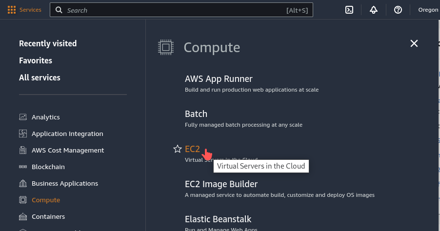
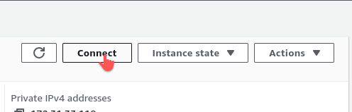

# jgi-user-meeting-aws-ec2
## Using terraform to create an AWS EC2 instance with preinstalled packages for:
### [BioIT Hackathon](https://www.bio-itworldexpo.com/fair-data-hackathon) (JGI-NCBI) in Boston - May 15-16, 2023
 * https://github.com/ncbi/PSSS-Bytes2Biology/wiki/Workflow

### [JGI-NCBI Workshop](https://usermeeting.jgi.doe.gov/past-meetings/2022-agenda/2022-meeting/) in Berkeley - September 1, 2022
 * https://hackmd.io/PZ_rCS6bS8S8yD0UnK79Ww 

### Pre-installed packages
  * SRAtoolkit, awscli, python3.10-venv, numpy, samtools, ncbi-blast+, and elastic-blast 

## 1. Install Terraform (1.2.0+ required):
### Mac OS X
```
$ brew install terraform
$ brew update
$ brew upgrade terraform
$ terraform --version
```

## 2. AWS credentials setup
To use your IAM credentials to authenticate the Terraform AWS provider, set the `AWS_ACCESS_KEY_ID` and `AWS_SECRET_ACCESS_KEY` environment variables.
```
$ export AWS_ACCESS_KEY_ID=
$ export AWS_SECRET_ACCESS_KEY=
```

## 3. Create a new EC2 under the current root account
With the default configuration in [variables.tf](./variables.tf), it will create a Ubuntu 20 instance with 4-core cpu, 8-GB ram and 237-GB nvme-ssd (instance type: `c6id.xlarge`, about $0.2016/hr), and install the required packages and tools. 
#### Validation, Plan, and Review
```
$ make init
$ make validate
```
```
$ make plan
```

#### Create a new EC2
```
$ make apply
```

#### View the public IP of EC2
```
$ make output
```

#### Or simply run all above steps:
```
$ make all
```

## 4. EC2 login
* Open the EC2 Dashboard from AWS Management Console: Services -> Compute -> EC2
  * 
* Choose Region -> __US West(Oregon) us-west-2__
  * 
* In the navigation pane, choose Instances.
  * 
* Select the instance (__demo-eblast-workshop__) and choose Connect.
  * 
  * 
* Choose EC2 Instance Connect (use the default username: `ubuntu`).
  * 


After login, you can find the required tools and scripts at `/home/ubuntu/tools` and `/home/ubuntu/scripts`. The root volume size is 194GB and the NVME-SSD (217GB) is mounted on `/home/ubuntu/nvme_ssd`

```
ubuntu@ip-172-31-49-23:~$ ls
nvme_ssd  scripts  tools

ubuntu@ip-172-31-49-23:~$ df -h
Filesystem       Size  Used Avail Use% Mounted on
/dev/root        194G  2.4G  192G   2% /
devtmpfs         3.9G     0  3.9G   0% /dev
tmpfs            3.9G     0  3.9G   0% /dev/shm
tmpfs            781M  840K  781M   1% /run
tmpfs            5.0M     0  5.0M   0% /run/lock
tmpfs            3.9G     0  3.9G   0% /sys/fs/cgroup
/dev/loop0        26M   26M     0 100% /snap/amazon-ssm-agent/5656
/dev/loop2        68M   68M     0 100% /snap/lxd/22753
/dev/loop1        56M   56M     0 100% /snap/core18/2409
/dev/nvme0n1p15  105M  5.2M  100M   5% /boot/efi
/dev/loop3        47M   47M     0 100% /snap/snapd/16292
/dev/loop4        62M   62M     0 100% /snap/core20/1518
/dev/nvme1n1     217G   61M  206G   1% /home/ubuntu/nvme_ssd
tmpfs            781M     0  781M   0% /run/user/1000
```

## 5. Terminate the EC2 and delete the security-group
```
$ make destroy
```

## 6. Reuse the EC2 module file 
If more packages are required to be pre-installed, please modify the [EC2 module file](./modules/ec2_instance/main.tf), and create a new instance by running `$ make all`.
